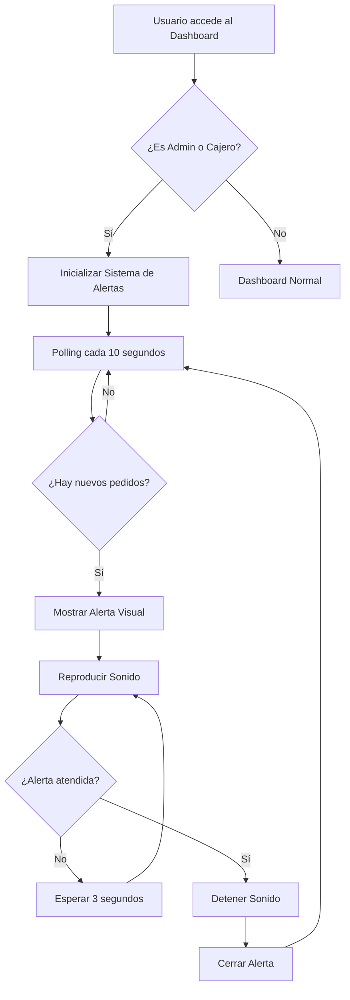

# Demostración del Sistema de Alertas de Pedidos

## Vista del Dashboard con Alerta

El sistema muestra una alerta elegante en la parte superior del dashboard cuando se recibe un nuevo pedido:

```
┌─────────────────────────────────────────────────────────────────────┐
│                         DASHBOARD                                    │
│  ┌───────────────────────────────────────────────────────────────┐  │
│  │  🔔 ¡Nuevo Pedido Recibido!                            [X]    │  │
│  │                                                                │  │
│  │  Pedido #214 - Mesa 1                                         │  │
│  │  👤 Enoc Estrada Resendiz | 🕐 13:33 | 📋 4 items            │  │
│  │                                                                │  │
│  │                                    [👁️ Ver Pedido]            │  │
│  └───────────────────────────────────────────────────────────────┘  │
│                                                                      │
│  Quick Stats Cards                                                  │
│  ┌──────────┐ ┌──────────┐ ┌──────────┐ ┌──────────┐            │
│  │  Mesas   │ │  Ventas  │ │ Propinas │ │ Pedidos  │            │
│  │    24    │ │  $490.00 │ │   ...    │ │    3     │            │
│  └──────────┘ └──────────┘ └──────────┘ └──────────┘            │
└─────────────────────────────────────────────────────────────────────┘
```

## Características de la Alerta

### 1. **Diseño Visual**
- ⚠️ Color amarillo/naranja para indicar atención requerida
- 🎨 Degradado elegante (amarillo claro a dorado)
- 🌟 Animación suave de entrada (slideDown)
- 📍 Borde izquierdo grueso para destacar
- 🔔 Icono de campana animado

### 2. **Información Mostrada**
- **Número de Pedido**: #214 (identificador único)
- **Ubicación**: Mesa 1 (o "Para llevar" si aplica)
- **Mesero**: Enoc Estrada Resendiz
- **Hora**: 13:33 (hora de creación)
- **Items**: 4 items (cantidad de platillos)

### 3. **Acciones Disponibles**
- **[👁️ Ver Pedido]**: Botón principal que redirige a `/orders/show/214`
- **[X]**: Botón de cerrar para descartar la alerta
- Ambas acciones detienen el sonido

### 4. **Comportamiento del Sonido**
```
🎵 Do - Mi - Sol (Acorde mayor)
├─ Frecuencias: 523.25 Hz, 659.25 Hz, 783.99 Hz
├─ Duración: 0.7 segundos
├─ Repetición: Cada 3 segundos
└─ Detención: Al atender o cerrar la alerta
```

## Flujo de Funcionamiento



## Ejemplo de Uso

### Escenario 1: Nuevo Pedido de Mesa
1. Mesero toma un pedido en Mesa 5
2. Mesero crea el pedido en el sistema
3. **Alerta aparece** en dashboards de admin y cajero en máximo 10 segundos
4. **Sonido empieza** a reproducirse cada 3 segundos
5. Cajero hace clic en "Ver Pedido"
6. Sistema redirige a `/orders/show/215`
7. **Sonido se detiene** automáticamente
8. Cajero puede procesar el pedido

### Escenario 2: Múltiples Pedidos
1. Se crean 3 pedidos casi simultáneamente
2. Sistema muestra **3 alertas apiladas**
3. Sonido continúa hasta atender todas
4. Admin cierra alerta 1 con [X]
5. Admin ve pedido 2 con el botón
6. Alerta 3 permanece hasta ser atendida

## Compatibilidad

| Característica | Chrome | Firefox | Safari | Edge |
|---------------|--------|---------|--------|------|
| Web Audio API | ✅ | ✅ | ✅ | ✅ |
| Fetch API | ✅ | ✅ | ✅ | ✅ |
| CSS Animations | ✅ | ✅ | ✅ | ✅ |
| Visibility API | ✅ | ✅ | ✅ | ✅ |

## Consideraciones Especiales

### Autoplay Policy
Los navegadores modernos requieren interacción del usuario antes de permitir audio:
- ✅ El sistema espera el primer clic/tecla
- ✅ Si hay alerta antes de interacción, muestra visual sin sonido
- ✅ Al interactuar, el sonido comienza a funcionar
- ✅ Cola de sonidos pendientes se procesa automáticamente

### Ahorro de Recursos
- ⏸️ Polling se pausa cuando la pestaña no está visible
- 🔇 Sonido se detiene cuando no hay alertas activas
- ♻️ Alertas duplicadas se previenen automáticamente
- 📊 Validación de timestamps previene consultas inválidas

## Personalización Futura

Posibles mejoras que se pueden implementar:

1. **Configuración de Usuario**
   - Volumen del sonido
   - Intervalo de polling
   - Tipo de notificación

2. **Filtros de Alerta**
   - Solo mesas específicas
   - Solo ciertos meseros
   - Horarios específicos

3. **WebSocket**
   - Reemplazo del polling por notificaciones en tiempo real
   - Mayor eficiencia y menor latencia

4. **Historial**
   - Registro de alertas recibidas
   - Estadísticas de tiempo de respuesta

## Seguridad Implementada

✅ **Autenticación**: API requiere sesión válida
✅ **Autorización**: Solo admin y cajero tienen acceso
✅ **XSS Prevention**: Todos los datos son escapados
✅ **Input Validation**: Timestamps validados con DateTime
✅ **Rate Limiting**: Polling controlado a 10 segundos mínimo
✅ **SQL Injection**: Consultas preparadas en PDO
